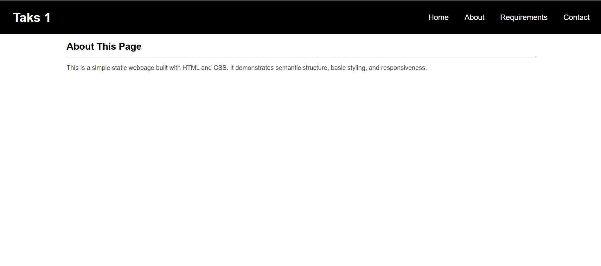
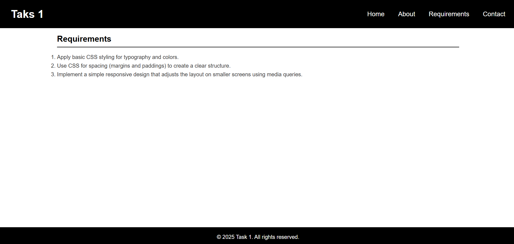
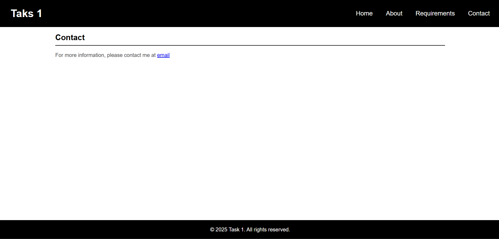
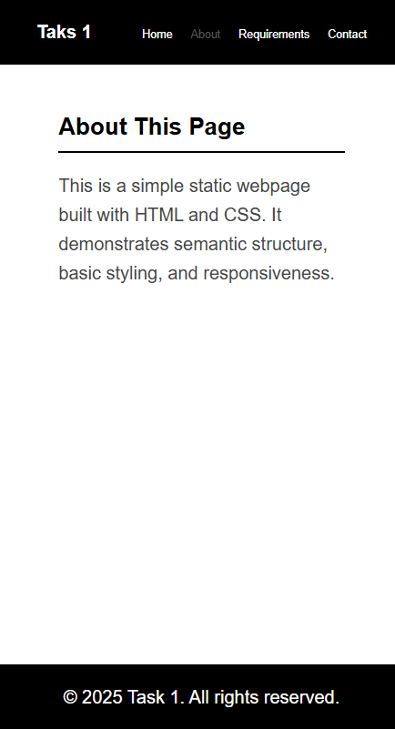
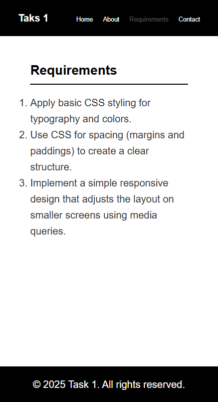
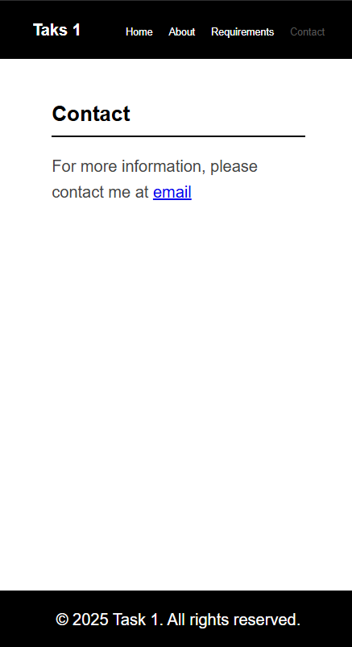

# Static Webpage Layout

Create a single-page website using semantic HTML elements such as <header>, <nav>, <main>, and <footer>.

## Requirements
- Apply basic CSS styling for typography and colors.
- Use CSS for spacing (margins and paddings) to create a clear structure.
- Implement a simple responsive design that adjusts the layout on smaller screens using media queries.

## Final Result

