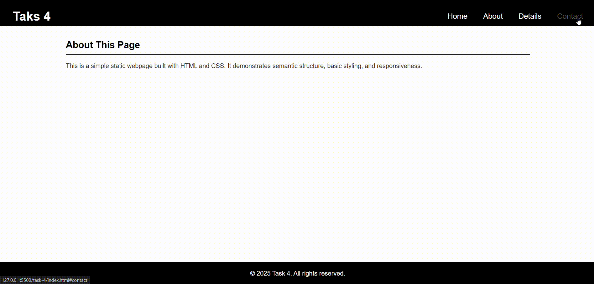
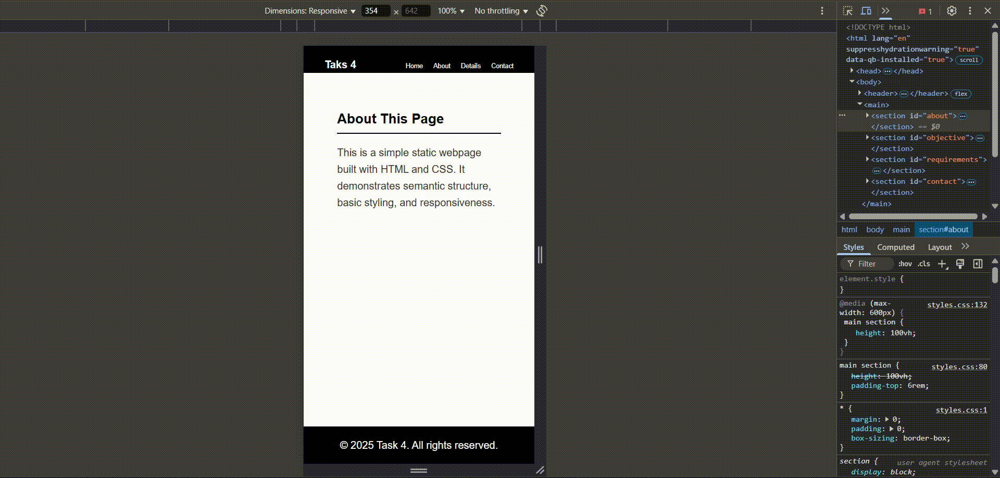

# Pure CSS Dropdown Menu

Design a navigation bar with a dropdown submenu that appears on hover.

## Requirements
- Use nested ul elements for the menu and submenu.
- Employ CSS pseudo-classes like :hover and transitions to create a smooth reveal effect.
- Ensure that the menu looks good on both desktop and mobile (consider using a responsive fallback).

## Demo
Below is a GIF demonstrating the given tasks:

