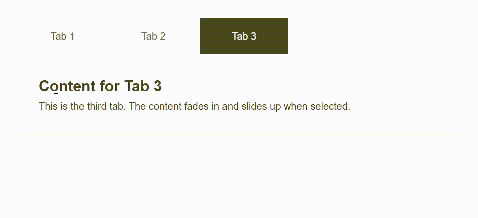

# Tabbed Content Interface

Create a tabbed interface where clicking on a tab shows different content sections.

## Requirements
- Utilize radio buttons or checkboxes (hidden from view) along with labels to serve as tabs.
- Use the :checked pseudo-class to display the corresponding content while hiding others.
- Incorporate smooth transitions when switching between tabs.

## Demo
Below is a GIF demonstrating the given tasks:

